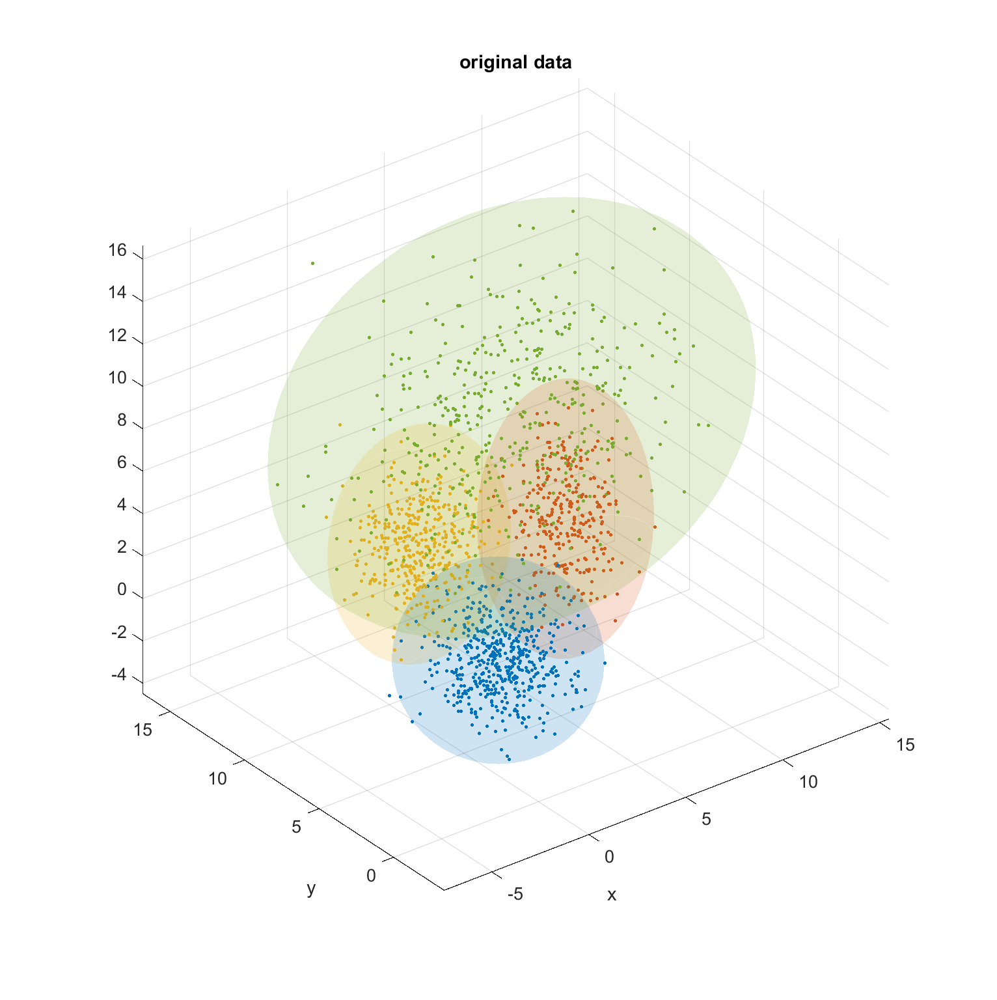
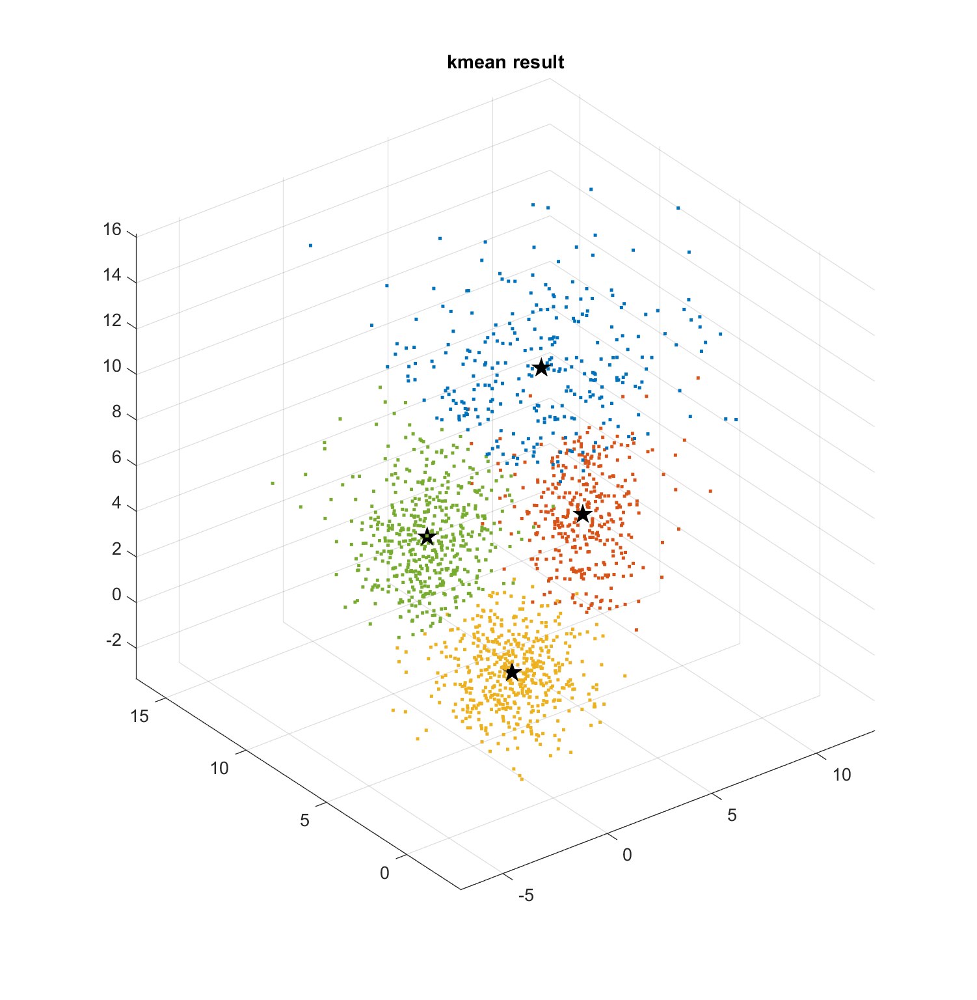
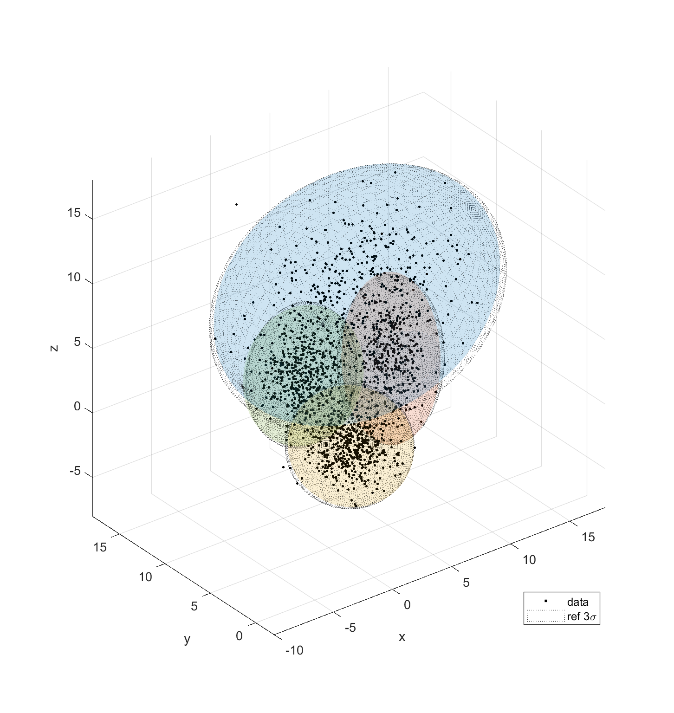
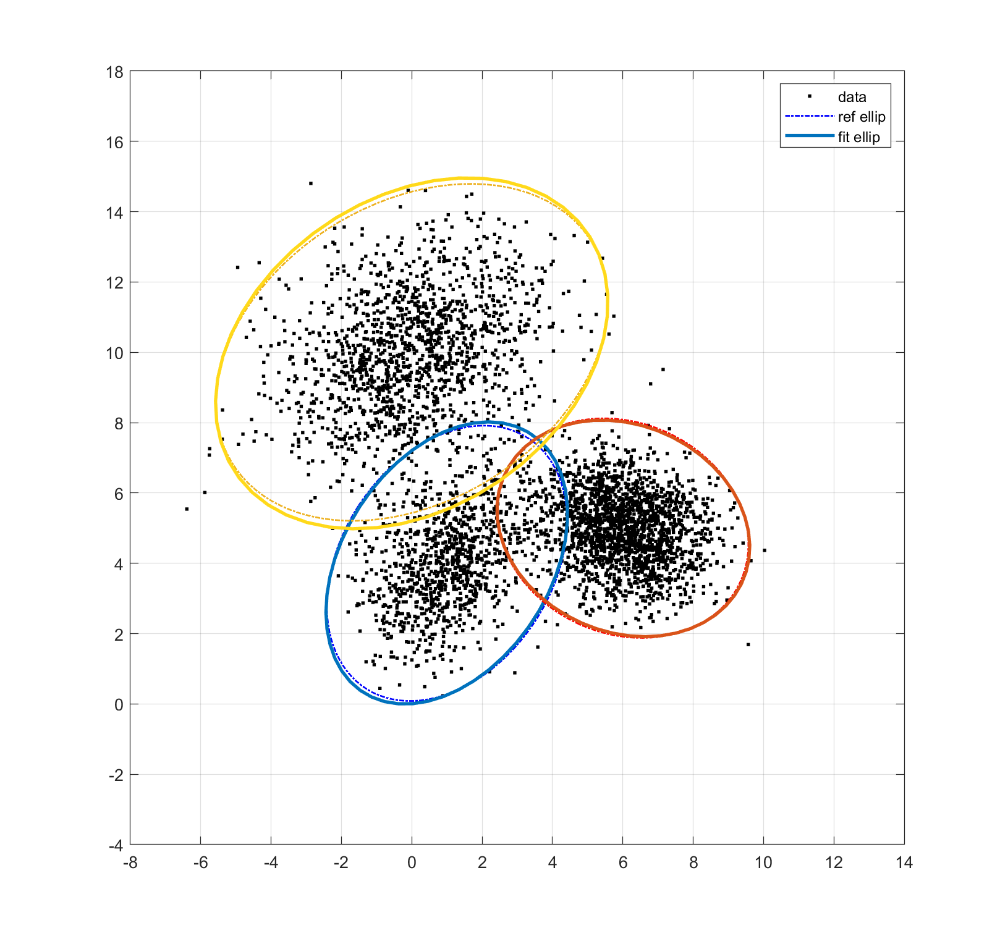

# Expectation-Maximization
EM Algorithm: Identify n sets of multi dimension gaussian data. 

Using Matlab. No Toolbox Needed.

**Mean Function**: <u>emfit.m</u>

**Function Examples**: <u>test_em_2d.mlx</u> and <u>test_em_3d.mlx</u>

Initial guess is important, a good way is use k-mean results as initial guess:

Final Results:

2D example:

